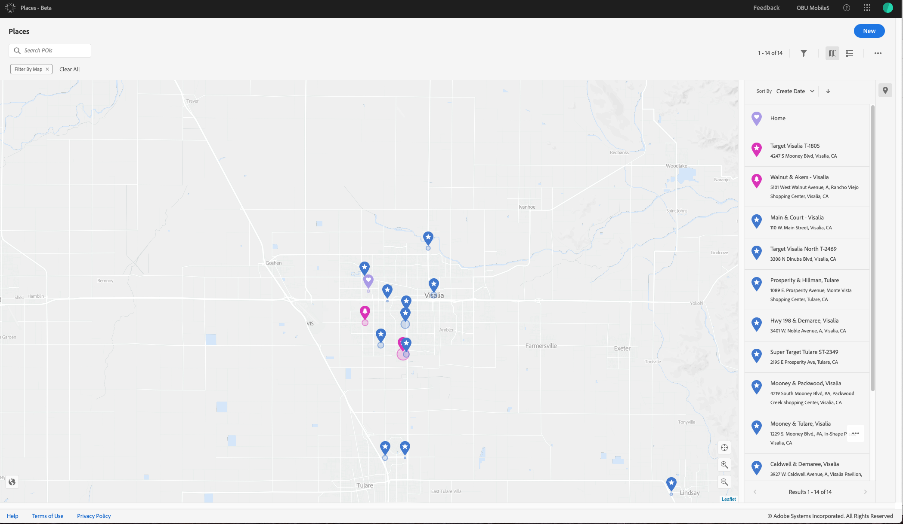

# Panoramica {#home}

Adobe Places è un contesto importante per comprendere il coinvolgimento degli utenti di dispositivi mobili. Utilizzando questo contesto, gli sviluppatori di app mobili possono migliorare la progettazione dell'app e renderla un'esperienza più personalizzata e coinvolgente. Places è un servizio di geolocalizzazione che consente agli sviluppatori di app mobili di comprendere il contesto della posizione utilizzando interfacce SDK ricche e facili da usare, accompagnate da un database flessibile di punti di interesse (POI).

Luoghi consente di ottenere quanto segue:

* Crea e gestisci un database di POI che puoi sfruttare con altre soluzioni Adobe Experience Cloud.
* Allegate metadati personalizzati ai POI per renderli più ricchi e significativi specificando attributi aggiuntivi.
* Visualizzate i POI su una mappa per comprendere facilmente il contesto spaziale e aggiungere/modificare gli attributi dei metadati.
* Configura l’SDK in Adobe Experience Platform Launch per definire le regole attivate dalla posizione e le condizioni basate sui metadati.
* Riducete il codice necessario per scrivere nella posizione di un dispositivo di monitoraggio e utilizzate il monitoraggio della posizione di Adobe per attivare automaticamente le regole specifiche per la posizione.

In questo modo potrete eseguire azioni dai segnali di posizione in tempo reale, quando e dove sono importanti. Il contesto giusto offre un'esperienza di coinvolgimento mobile più arricchente.

Di seguito sono riportati alcuni modi per utilizzare i Luoghi:

* Invia una notifica in tempo reale quando qualcuno entra in un POI, *"Hey.benvenuto allo stadio."*
* Analizzare il traffico di pedoni tra i negozi e i negozi concorrenti.
* Segmentate un'audience in base al comportamento offline utilizzando i profili di audience con contesto della posizione.
* Esegue il targeting di un utente con un'esperienza in-store quando pertinente.

## Posiziona i componenti

Le posizioni comprendono i seguenti componenti:

* **Luoghi del servizio Web**

   Potete creare e gestire i POI utilizzando le API REST. Per ulteriori informazioni sulle API REST, vedere Servizi [Web](/help/places-rest-apis/api-usage/api-usage.md)Luoghi.

* **Interfaccia utente Luoghi**

   Visualizzare i POI su una mappa per comprendere il contesto spaziale e aggiungere o modificare i POI e i relativi metadati personalizzati.

* **Places SDK**

   L'interfaccia API mobile multipiattaforma per integrare il contesto della posizione nelle app mobili. Per ulteriori informazioni sugli SDK, vedi Estensione Luoghi.

* **Regole di posizione**

   Regole di Launch geo-intelligenti che consentono di attivare azioni con eventi di entrata e uscita. Le regole consentono inoltre di utilizzare gli attributi geografici in condizioni per personalizzare l'esperienza.

* **Monitor Luoghi**

   L’SDK per dispositivi mobili multipiattaforma che può essere incorporato nell’app mobile per monitorare automaticamente i cambiamenti di posizione dell’utente e attivare le regole di posizione. Per ulteriori informazioni, consultate Estensione [Monitor](/help/configure-places-in-the-sdk/places-monitor-extension/places-monitor-extension.md)posizioni.

## Terminologia

Di seguito sono riportati alcuni termini comuni utilizzati nella documentazione:

* Un **punto di interesse (POI)** è una geolocalità che interessa la tua organizzazione.

   Potete definire i POI con attributi quali nome, raggio, indirizzo, categoria e tag di metadati.

* Una **geofence** è un tipo di POI.

   Questo tipo di POI è un limite geografico virtuale definito dalle coordinate di latitudine e longitudine.

* Un **beacon** è un tipo di POI.

   Questo tipo di POI è un dispositivo fisico che rappresenta una posizione emettendo un segnale Bluetooth a bassa potenza. Il supporto dei beacon verrà rilasciato in una versione futura.

* Una **libreria** è una raccolta di POI, raggruppati per allegare facilmente le regole a un set invece di un POI.

* Un’ **estensione** SDK è l’estensione Experience Platform Launch necessaria per integrare l’SDK Places nelle app mobili.

   L’estensione utilizzata con gli altri SDK per dispositivi mobili per aggiungere contesto di posizione alle esperienze.

* Un' **organizzazione** è l'entità Adobe che identifica la tua società in Adobe Experience Cloud.

   In genere, un'organizzazione è il vostro nome società. Tuttavia, un'azienda può avere più di un'organizzazione. L’amministratore dell’organizzazione può configurare gruppi e utenti e configurare la funzionalità di Single Sign-On.

* L’ **orgID** è l’ID che rappresenta la tua organizzazione in Adobe Experience Platform.

   Per ulteriori informazioni, vedi [Ricerca del tuo orgID](https://forums.adobe.com/thread/2339895).

* The **Experience Cloud ID** service provides a universal, persistent ID that identifies your visitors across all the solutions in the Experience Cloud.

   For more information, see [Overview](https://docs.adobe.com/content/help/en/id-service/using/intro/overview.html).

## Interfaccia utente Luoghi

Per accedere all’interfaccia utente Luoghi, in un browser, accedete all’interfaccia utente  Luoghi ed effettuate l’accesso con il vostro Adobe ID.

Seguono alcune informazioni di base per acquisire familiarità con l’interfaccia utente:

* Nell’angolo in alto a destra sono disponibili dei pulsanti su cui è possibile fare clic per creare una libreria, POI e filtrare la ricerca.
* Nell'angolo inferiore destro dello schermo sono presenti pulsanti per ingrandire e ridurre, centrare la posizione corrente **[!UICONTROL Find Me]** e passare dalla vista mappa a quella satellitare.
* Fate doppio clic per ingrandire o fate clic e trascinate per reimmettere la mappa.
* È inoltre possibile utilizzare i tasti freccia per scorrere la mappa.

## Flusso di lavoro Luoghi

Di seguito è riportata una vista di alto livello del flusso di lavoro Luoghi:

